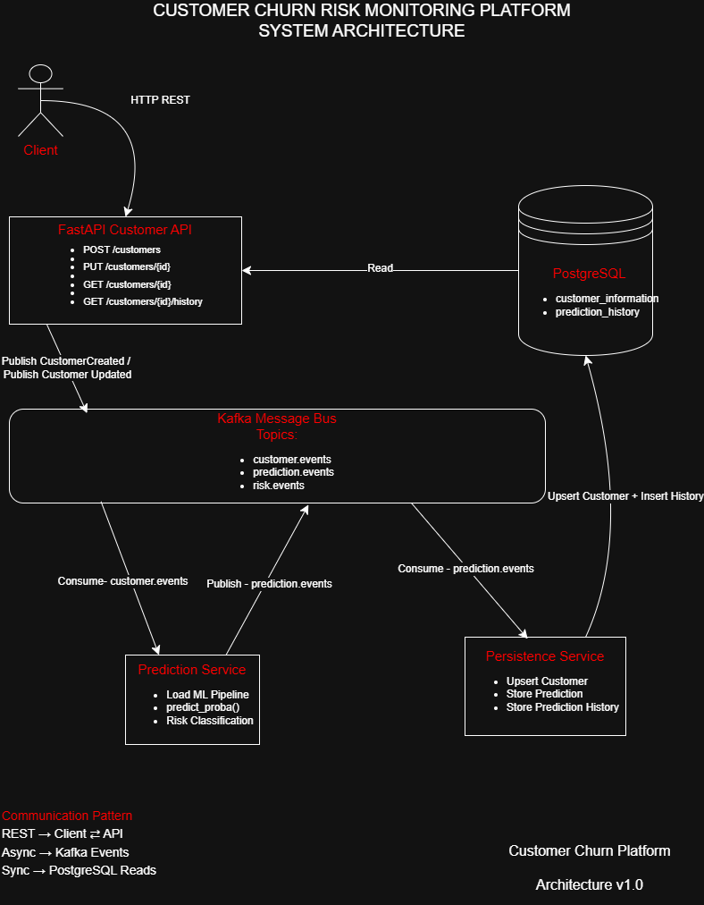
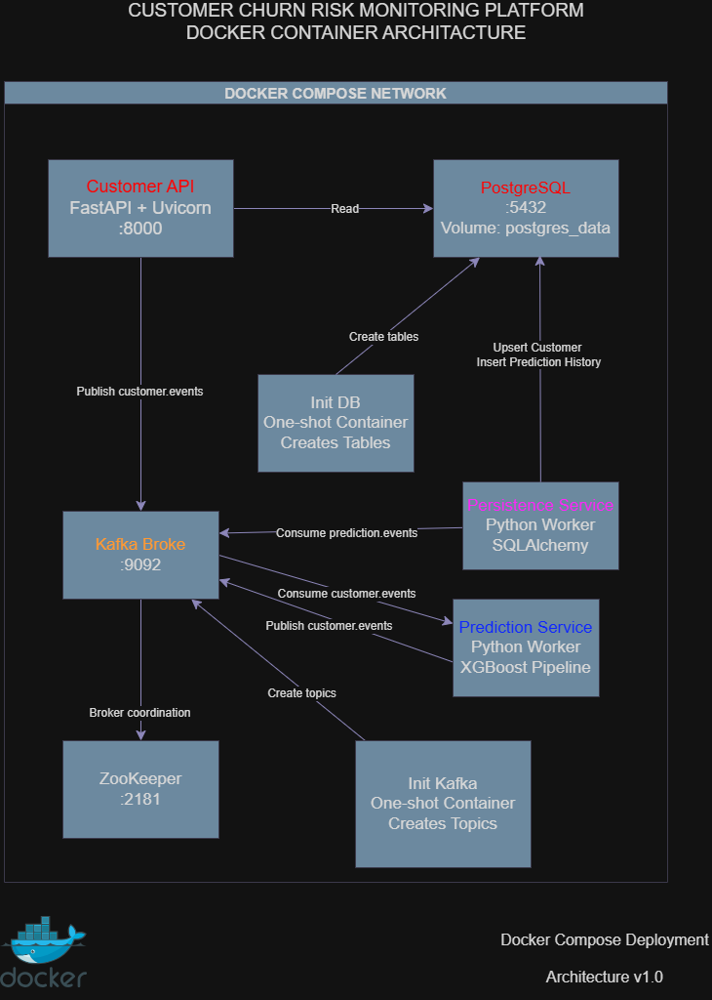
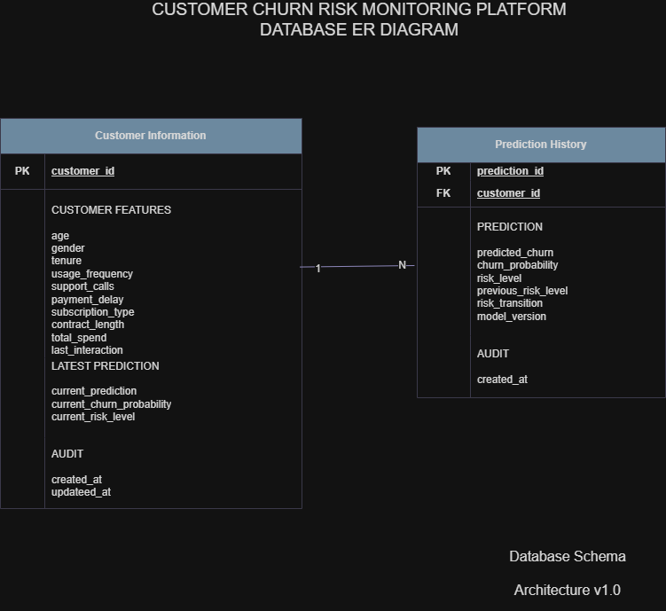

# 🚀 Customer Churn Risk Monitoring Platform

> 🚧 This project is actively under development. Monitoring (Prometheus & Grafana) and cloud deployment are planned in upcoming iterations.

An event-driven customer churn prediction platform built with **FastAPI**, **Kafka**, **PostgreSQL**, **Docker**, and **XGBoost**.

The system predicts customer churn probability in real time, stores prediction history, tracks risk transitions, and exposes REST APIs for customer monitoring.

---

# ✨ Features

- Customer Management API (FastAPI)
- Event-Driven Architecture (Kafka)
- Real-time Churn Prediction
- Prediction History Tracking
- Risk Level Monitoring
- PostgreSQL Persistence
- Dockerized Microservices
- XGBoost Machine Learning Model

---

---

# ⚙️ Tech Stack

| Category | Technology |
|-----------|------------|
| Backend | FastAPI |
| Machine Learning | XGBoost |
| Data Processing | Pandas, NumPy |
| Database | PostgreSQL |
| ORM | SQLAlchemy |
| Event Streaming | Apache Kafka |
| Containerization | Docker & Docker Compose |
| Monitoring | Prometheus |
| API Documentation | Swagger UI |

---

# 📂 Project Structure

```
customer-churn-platform/
│
├── data/
├── docs/
│   ├── images/
│   └── system-design.drawio
│
├── logs/
├── model_artifacts/
├── notebooks/
├── src/
│   ├── api/
│   ├── database/
│   ├── inference/
│   ├── kafka/
│   ├── services/
│   ├── training/
│   └── utils/
│
├── tests/
│
├── docker-compose.yml
├── Dockerfile
├── prometheus.yml
├── requirements.txt
├── README.md
└── .env.example
```

---

# 🚀 Getting Started

## Clone repository

```bash
git clone https://github.com/yourusername/customer-churn-platform.git

cd customer-churn-platform
```

---

## Create environment file

```bash
cp .env.example .env
```

Update the environment variables if necessary.

---

## Start the project

```bash
docker compose up --build
```

---
## 📐 Architecture
The platform follows an event-driven microservice architecture.

The overall workflow is:

- Client sends customer data to the FastAPI service.
- Customer events are published to Kafka.
- Prediction Service consumes customer events and performs ML inference.
- Prediction results are published back to Kafka.
- Persistence Service stores customer snapshots and prediction history in PostgreSQL.
- REST endpoints retrieve the latest customer state and prediction history.

The following diagrams illustrate the architecture in detail.

### System Architecture



---

### Docker Container Architecture



---

### Database ER Diagram



---

> Editable diagrams are available in `docs/system-design.drawio`.

---
## API Documentation

Swagger UI

```
http://localhost:8000/docs
```

OpenAPI

```
http://localhost:8000/openapi.json
```

---

# 📌 API Endpoints

## Create Customer

```
POST /customers
```

Example Request

```json
{
  "customer_id": 1015,
  "Age": 35,
  "Gender": "Male",
  "Tenure": 6,
  "Usage Frequency": 4,
  "Support Calls": 3,
  "Payment Delay": 8,
  "Subscription Type": "Standard",
  "Contract Length": "Annual",
  "Total Spend": 720.5,
  "Last Interaction": 12
}
```

---

## Get Customer

```
GET /customers/{customer_id}
```

Example Response

```json
{
  "customer_id": 1015,
  "age": 35,
  "gender": "Male",
  "tenure": 6,
  "usage_frequency": 4,
  "support_calls": 3,
  "payment_delay": 8,
  "subscription_type": "Standard",
  "contract_length": "Annual",
  "total_spend": 720.5,
  "last_interaction": 12,
  "current_prediction": false,
  "current_churn_probability": 0.0323,
  "current_risk_level": "LOW"
}
```

---

## Prediction History

```
GET /customers/{customer_id}/history
```

Returns every prediction made for the customer.

---

## Risk Alerts

```
GET /alerts/risk-increased
```

Returns customers whose risk level increased.

---

# 🧠 Machine Learning

Model:

- XGBoost Classifier

Pipeline:

- ColumnTransformer
- OneHotEncoder
- XGBoost

Outputs:

- Churn Probability
- Predicted Churn
- Risk Level

Risk Levels

| Probability | Risk |
|--------------|------|
| < 0.40 | LOW |
| 0.40 - 0.70 | MEDIUM |
| > 0.70 | HIGH |

---

# 📊 Event Flow

Customer Created

```
CustomerCreated
        │
        ▼
customer.events
        │
        ▼
Prediction Service
        │
        ▼
PredictionCreated
        │
        ▼
prediction.events
        │
        ▼
Persistence Service
        │
        ▼
PostgreSQL
```

---

# 🐳 Docker Services

The project currently runs the following Docker services:

- PostgreSQL
- ZooKeeper
- Kafka
- Customer API
- Prediction Service
- Persistence Service
- Database Initialization Service
- Kafka Topic Initialization Service

---

# 📈 Monitoring | Planned (Prometheus & Grafana)

Monitoring with Prometheus and Grafana is planned as the next phase of the project.

Planned features:

- Prometheus metrics collection
- Grafana dashboards
- API performance monitoring
- Kafka monitoring
- PostgreSQL monitoring

---

# 🔮 Future Improvements

- Integrate Prometheus metrics collection
- Build Grafana dashboards
- Kafka UI
- AWS RDS deployment
- CI/CD pipeline (GitHub Actions)
- Model Registry (MLflow)
- Authentication & Authorization (JWT)
- Batch prediction endpoint
- Retraining pipeline
---

# 👨‍💻 Author

**Sabri**

Customer Churn Risk Monitoring Platform

Built with FastAPI, Kafka, PostgreSQL, Docker and XGBoost.