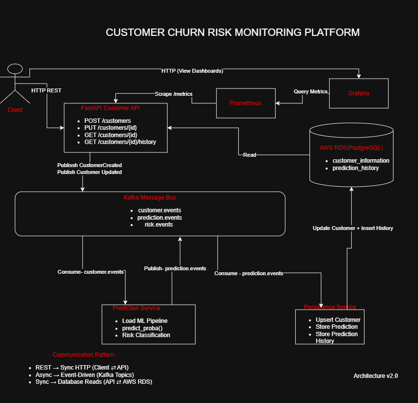
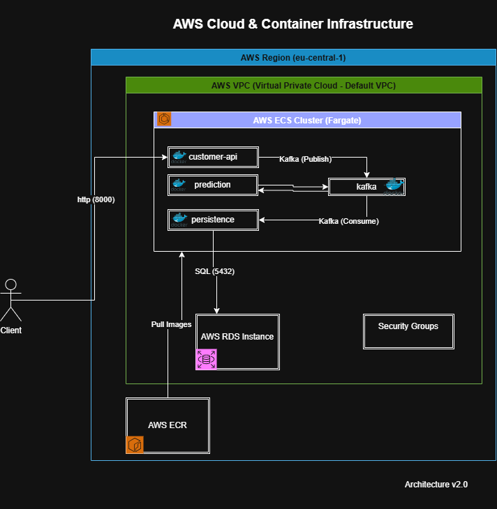
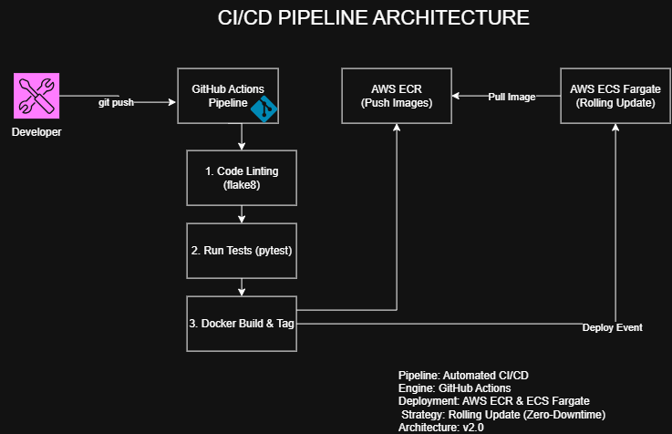
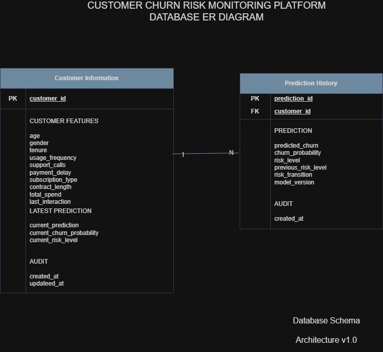

# 🚀 Customer Churn Risk Monitoring Platform

An event-driven, production-ready customer churn prediction platform built with **FastAPI**, **Kafka**, **PostgreSQL**, **XGBoost**, and fully automated on **AWS Infrastructure via Terraform & GitHub Actions**.

The system predicts customer churn probability in real time, stores prediction history, tracks risk transitions, exposes REST APIs for monitoring, and deploys natively to AWS Serverless Container Infrastructure (ECS Fargate).

---

# ✨ Features

- **Customer Management API:** High-performance RESTful endpoints using FastAPI.
- **Event-Driven Architecture:** Asynchronous event streaming powered by Apache Kafka.
- **Real-time Churn Prediction:** Machine learning inference powered by XGBoost.
- **Data Persistence:** Relational prediction history and risk level tracking stored in PostgreSQL.
- **Infrastructure as Code (IaC):** Entire AWS cloud footprint managed seamlessly with Terraform.
- **Serverless Cloud Compute:** Deployed to AWS ECS Fargate with zero server management.
- **Automated CI/CD Pipeline:** Fully automated build, test, Docker image push (AWS ECR), and rolling deployment (AWS ECS) via GitHub Actions.

---

# ⚙️ Tech Stack

| Category | Technology                                              |
|-----------|---------------------------------------------------------|
| **Backend & API** | FastAPI, Swagger UI                                     |
| **Machine Learning** | XGBoost, Pandas, NumPy, Scikit-learn                    |
| **Event Streaming** | Apache Kafka (KRaft mode)                               |
| **Database** | PostgreSQL, AWS RDS (PostgreSQL)                        |
| **ORM & Driver** | SQLAlchemy, psycopg2                                    |
| **Containerization** | Docker, Docker Compose, AWS ECR                         |
| **Cloud & IaC** | AWS (ECS Fargate, RDS, IAM, Security Groups), Terraform |
| **CI/CD & Testing** | GitHub Actions, Pytest, Flake8                          |
| **Monitoring (Local)** | Prometheus, Grafana (Local dev)                         |

---

# ☁️ Cloud Infrastructure & CI/CD Pipeline

The platform uses a fully automated **Cloud Deployment Strategy** using Terraform and GitHub Actions.

### 🏗️ AWS Cloud Architecture
- **AWS ECS Fargate:** Serverless container execution for API, Prediction, Persistence, and Kafka services.
- **AWS RDS (PostgreSQL):** Fully managed, isolated database instance running inside AWS VPC.
- **AWS ECR:** Amazon Elastic Container Registry storing versioned microservice Docker images.

### 🔄 CI/CD Workflow
Every `push` or `pull_request` to the `main` or `feature/*` branches triggers the GitHub Actions workflow:

```text
Code Push ──► Static Code Check (flake8) ──► Unit Tests (pytest) ──► AWS ECR Build & Push ──► AWS ECS Fargate Rolling Deploy
```
---
1. Linting & Code Quality: Code compliance checked via flake8.

2. Automated Testing: Executed via pytest.

3. AWS Authentication: Connects securely to AWS via GitHub Repository Secrets.

4. ECR Push & ECS Update: Container images are built and pushed to AWS ECR, triggering a zero-downtime rolling update on AWS ECS Fargate.
---

# 📂 Project Structure

```text
customer-churn-platform/
│
├── .github/
│   └── workflows/
│       ├── ci.yml          # Local CI Pipeline (Tests & Linting)
│       └── deploy.yml      # AWS ECR & ECS Automated Deployment
├── docs/
│   ├── images/
│   └── system-design.drawio
├── terraform/              # Infrastructure as Code (IaC)
│   ├── main.tf             # VPC, ECR, & Provider configs
│   ├── ecs.tf              # ECS Cluster, Task Definitions & Services
│   ├── rds.tf              # AWS RDS PostgreSQL Instance & SGs
│   ├── variables.tf
│   └── outputs.tf
├── src/
│   ├── api/
│   ├── database/
│   ├── inference/
│   ├── kafka/
│   ├── services/
│   ├── training/
│   └── utils/
├── tests/                  # Pytest Unit Tests
├── docker-compose.yml
├── Dockerfile
├── requirements.txt
└── README.md
```

---

# 🚀 Getting Started

### 1. Local Development ( Docker Compose)

## Clone repository

```bash
git clone [https://github.com/sabricetinkaya/customer-churn-platform.git](https://github.com/sabricetinkaya/customer-churn-platform.git)
cd customer-churn-platform
```

---

## Create environment file

```bash
cp .env.example .env
```

Update the environment variables if necessary.

---
---

## Run Unit Tests Locally
```bash
pip install -r requirements.txt
pytest
```
---

## Start Services Locally

```bash
docker compose up --build
```

---
### 2. Cloud Development (AWS via Terraform)

```bash
cd terraform

# Initialize Terraform modules
terraform init

# Plan and preview cloud resources
terraform plan

# Deploy infrastructure to AWS
terraform apply

# Destroy all cloud resources (to prevent unwanted charges)
terraform destroy
```

---
## 📐 System Architecture & Design

The platform is built using a modern, event-driven, and microservice-oriented architecture deployed on AWS infrastructure. Below are the detailed architectural diagrams representing different layers of the system.

---

### 1. High-Level System Architecture
Overview of the system components, data flow, ML pipeline integration, and observability layer (Prometheus & Grafana).



---

### 2. AWS Cloud & Container Infrastructure
Physical infrastructure layout on AWS using ECS Fargate, Managed RDS PostgreSQL, and ECR within a dedicated Virtual Private Cloud (VPC).



---

### 3. CI/CD & Automated Deployment Pipeline
Automated continuous integration and deployment workflow powered by GitHub Actions, AWS ECR, and ECS Fargate for zero-downtime rolling updates.



---

### 4. Database Schema (ER Diagram)
Entity-Relationship structure highlighting customer feature storage, risk predictions, and audit history tracking.


---
## API Documentation

Swagger UI

```
http://localhost:8000/docs
```

OpenAPI

```
http://localhost:8000/openapi.json
```

---

# 📌 API Endpoints

## Create Customer

```
POST /customers
```

Example Request

```json
{
  "customer_id": 1015,
  "Age": 35,
  "Gender": "Male",
  "Tenure": 6,
  "Usage Frequency": 4,
  "Support Calls": 3,
  "Payment Delay": 8,
  "Subscription Type": "Standard",
  "Contract Length": "Annual",
  "Total Spend": 720.5,
  "Last Interaction": 12
}
```

---

## Get Customer Current Risk State

```
GET /customers/{customer_id}
```

Example Response

```json
{
  "customer_id": 1015,
  "age": 35,
  "gender": "Male",
  "tenure": 6,
  "usage_frequency": 4,
  "support_calls": 3,
  "payment_delay": 8,
  "subscription_type": "Standard",
  "contract_length": "Annual",
  "total_spend": 720.5,
  "last_interaction": 12,
  "current_prediction": false,
  "current_churn_probability": 0.0323,
  "current_risk_level": "LOW"
}
```

---

## Prediction History

```
GET /customers/{customer_id}/history
```

Returns every prediction made for the customer.

---

## Risk Alerts

```
GET /alerts/risk-increased
```

Returns customers whose risk level increased.

---

# 🧠 Machine Learning

Model:

- XGBoost Classifier

Pipeline:

- ColumnTransformer
- OneHotEncoder
- XGBoost

Outputs:

- Churn Probability
- Predicted Churn
- Risk Level

Risk Levels

| Probability | Risk |
|--------------|------|
| < 0.40 | LOW |
| 0.40 - 0.70 | MEDIUM |
| > 0.70 | HIGH |

---

# 📊 Event Flow

Customer Created

```
Customer Data (REST API) ──► FastAPI (customer-api)
                                   │
                                   ▼ (Publishes CustomerCreated)
                            Kafka Topic
                                   │
                                   ▼ (Consumes Event)
                           Prediction Service (XGBoost)
                                   │
                                   ▼ (Publishes PredictionCreated)
                            Kafka Topic
                                   │
                                   ▼ (Consumes Prediction)
                          Persistence Service ──► AWS RDS PostgreSQL
```

---

# 🐳 Docker Services

The project currently runs the following Docker services:

- PostgreSQL
- ZooKeeper
- Kafka
- Customer API
- Prediction Service
- Persistence Service
- Database Initialization Service
- Kafka Topic Initialization Service

---

# 📈 Monitoring | Planned (Prometheus & Grafana)

Monitoring with Prometheus and Grafana is planned as the next phase of the project.

Planned features:

- Prometheus metrics collection
- Grafana dashboards
- API performance monitoring
- Kafka monitoring
- PostgreSQL monitoring

---

# 🔮 Future Improvements

- Centralized Grafana Dashboards for ECS Container Metrics
- Model Registry & Tracking using MLflow
- Authentication & Authorization (OAuth2 / JWT)
- Automated Model Retraining Pipeline

---

# 👨‍💻 Author

**sabricetinkaya**

Built with FastAPI, Apache Kafka, XGBoost, AWS ECS Fargate, RDS, Terraform, and GitHub Actions.